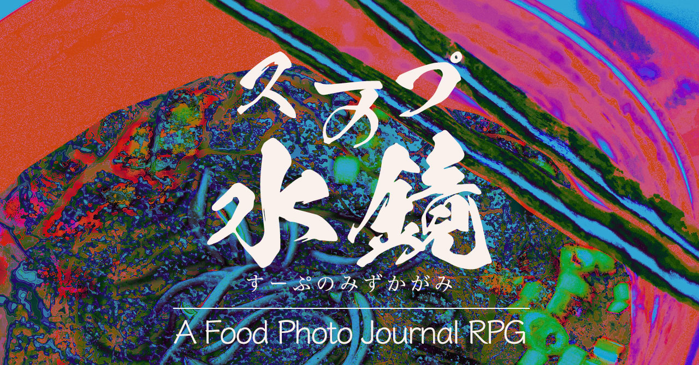
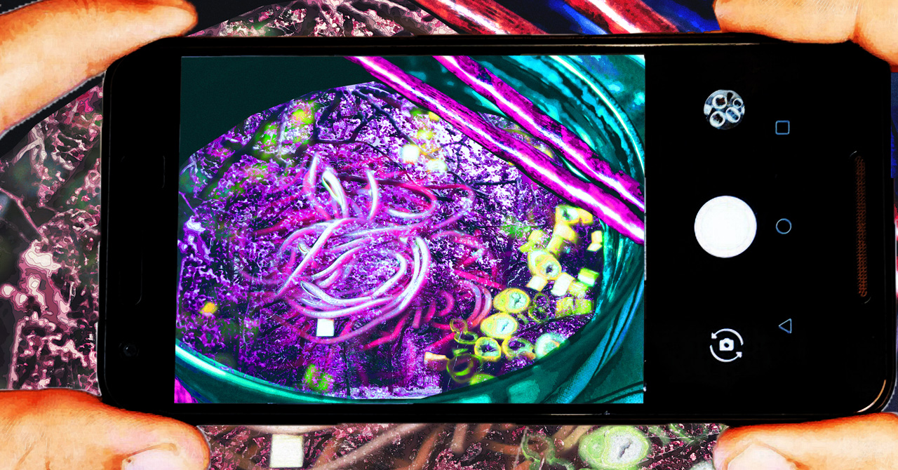

# フードフォト ジャーナリングRPG スープの水鏡

I respect-hacked this game after playing Hugeboar games' (@maxwllander) journaling photo RPG "Frame352".
I greatly admire their creativity. Maximum thanks to @maxwllander.
https://maxwellander.itch.io/frame-352

----

# イントロダクション
## 人が口にするスープは、妖怪を写す鏡でもある
日本には、ありとあらゆる自然現象や畏怖の対象を「神」として崇める風習がありました。

その後、「神」 は「妖怪」と呼ばれて親しまれましたが、今ではその事実は忘れられています。そのため、超常現象が起こっても対処できる人が少なくなってしまいました。

わずかに残っていた資料を元に、「妖怪」の概念を麺料理で体現する方法を確立します。
私たちは、麺料理を観察し、写真に撮り、実際に食べて「妖怪」を理解していくことになります。

### スープの水鏡とは？
このゲームは、妖怪の概念が宿った麺料理の証拠写真を集めて妖怪の事を調査するソロ・フードフォトジャーナリングRPGです。

あなた（キャラクター）は妖怪学の研究員として、麺料理（自分で料理しても良いし、お店の料理でも良い）の写真を撮り、ゲームの核となる占いシステムに応じて日記に記録をまとめます。

#### ゲームに必要なもの
* 麺料理（麺が汁に浸っている食べ物全般）
* カメラやスマートフォンなどの料理を撮影できる機材
* 日記やメモを書くためのノートと筆記用具。または記録できるツール
* 花札（日本独自のカルタカード）
* このドキュメント

# ゲームプレイ

## 実際の遊び方
本作を遊ぶ手順は、次の通りです。

1. “麺が汁に浸った麺料理が食べたい”と食欲を刺激されることが重要です - 食べたくなった麺料理は、自分で調理したものでも、お店の料理でも良いです。
2. あなたの目の前に麺料理の器が置かれたら、写真を撮ります - 撮影枚数に制限はありません。
3. 麺料理を食べながら、麺やスープについてメモを取ります - 麺の種類、スープの味や香りや暖かさ、具材（トッピング）について、料理の特徴的な部分をメモしておくと日記がスムーズにかけます。
4. 落ち着いて日記を書ける場所に到着したら、ゲームのメカニズムに従って日記を書きます。

この工程を何度も繰り返す必要があり、**【真実】**か**【噂】**を3つ収集できたら、今回の調査は終了です。

## メカニズム
### 妖怪を読み解く
花札を使った妖怪の読み取り方は、次の通りです。必ず麺料理を食べ終えた後に行いましょう。

#### 花札について
花札とは、1組48枚からなる四季を象徴とする日本特有のかるたカードです。このゲームでは、妖怪の存在を紐解くツールとして利用します。

#### 手順
1. 花札をよくシャッフルして、一山にまとめます(山札)。山札の上から4枚引いて、裏向きのまま自分の前におきます。
2. 落ち着いて花札を確認できる場所で、撮った写真を確認します - その写真はに写っている麺料理は、あなた
が発見した妖怪です。
3. 山札から引いた4枚の中から1枚選んで、絵柄を確認します - あなたが発見した妖怪について**【真実】**か**【噂】**かが決まります。

* 奇数月の札（松、桜、杜若、萩、菊、柳）：妖怪の**【噂】**
* 偶数月の札（桐、梅、藤、牡丹、芒、紅葉）：妖怪の**【真実】**

4. 3枚の裏向きカードから1枚を選んで、絵柄を確認します - 写真に写っている妖怪の情報の性質が決まります。

* 12月、1月、2月の札（桐、松、梅）- 妖怪の弱点
* 3月、4月、5月の札（桜、藤、杜若）- 妖怪が巻き起こす現象
* 6月、7月、8月の札（牡丹、萩、芒）- 妖怪が引き起こす暴力
* 9月、10月、11月の札（菊、紅葉、柳）- 妖怪の生態・特徴

5. 食べた麺料理のことを思い出し、麺料理を撮影した写真を眺め、以下の情報からさらに妖怪への理解を深めていきます。

##### 麺の種類
麺料理に使われていた麺の種類は、その妖怪の本当の姿を表しています。
* 蕎麦：植物
* うどん：昆虫類
* ラーメン：動物
* パスタ：魚介類
* 米麺：人
* その他（上記以外の麺・麺状）：器物

麺の太さや歯応えなどで、妖怪の体格に関するインスピレーションを得られます。太く長ければ巨漢かもしれないし、細く短ければ小柄かもしれません。

##### スープの種類
麺料理のスープの味は、その妖怪がどのような姿で人前に現れるかを表しています。
* 辛味や酸味：現世的
* 醤油などの和食系の甘味：精神的
* 魚介系の旨味：輪廻的
* 動物系のコクや油ぽさ：具象的

スープの香りや粘度や温度、どんぶりや料理の見た目などからも、妖怪がどのように化けて人前に姿を表すかインスピレーションを得ましょう。

##### 具材（トッピング）の種類
麺料理の上に乗っていた具材やトッピングは、その妖怪の追加情報を表しています。
* 野菜・山菜・海藻類：妖怪の住居や隠れ家、隠している宝、祀っている祭壇の場所
* 肉類・魚介類：妖怪の食料やエネルギー源、縄張り、狩猟場の場所
* 玉子・加工品（油揚げ、メンマ、天かすなど）：妖怪に関する手がかりや、存在を示すサイン
* 具材なし：妖怪の殺し方、封じ方

----

### 推奨されるメモの取り方
* 妖怪の名前（何回目の遭遇か）
* 日付と時間帯
* めくった1枚目の札の結果（**【真実】**か**【噂】**か）
* 妖怪に関する目撃情報や調査情報+日記（「スープの水鏡を通して何が見えたか？」的な描写があると良い）

### 2回目以降の調査
同じ料理を食べた際に、日記に書いた妖怪の調査を再開しましょう。もしくは、あらかじめ撮っておいた同じ料理の別写真を利用し、食べた日のことを改めて思い出しても良いです。

どちらでもあっても、以前の調査で引いたカードは捨札にします。ゲームが終了するまでは、山札へ戻さないようにしましょう。

調査を続行して日記を書くために山札から新たに4枚のカードを引き、ゲームのメカニズムを実行してください。

### 調査の終わり
**【真実】**か**【噂】**のどちらかが3つ揃った時点で終了します。**【真実】**が3つの場合、その妖怪の存在を証明した事になります。**【噂】**が3つになったら、妖怪の存在を否定した事になります。
万が一、実際に妖怪を発見した場合は、ゲームをやめて写真を撮り、安全を確保してください。

----

